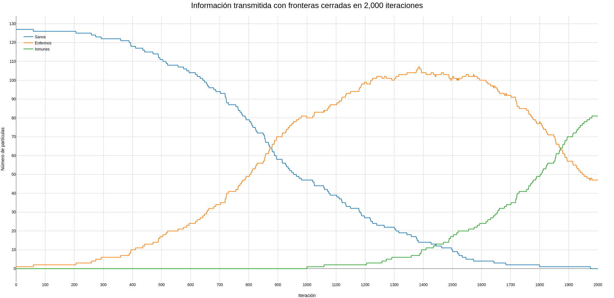

# Simulación de la transmisión de información
> **Nota**: este repositorio es un *fork* de [transmission](https://github.com/giccunam/transmission).

## Descripción
Este modelo simula como se transmite la información entre "partículas" bajo ciertas condiciones (con frontera abierta o frontera cerrada) en un tiempo determinado.

## Requisitos
- Compilador de C o C++  (gcc en nuestro caso)
- Python 3

## Instalación
1. Descarga el repositorio con el siguiente comando:
```
git clone https://github.com/ignacio-ireta/transmission.git
```

2.  Entra dentro de la carpeta **transmission** y crea un ambiente virtual de Python:
```
python3 -m venv venv
```

3.  Activa tu ambiente virtual e instala las librerías de Python:
```
pip install -r requirements.txt
```

## Uso
1. Entra a la carpeta **program** y compila los archivos de *C* con el siguiente comando:
```
 gcc -o main main.c montecarlo.c people.c population.c -lm
```

2. Ahora corre el siguiente comando redirigiendo la salida a un archivo ubicado en la carpeta **data**, sustituye  `x` por el nombre que desees ponerle a tu archivo:
```
./main >> ../data/x.dat
```

3. Por ultimo entra a la carpeta **visualization** y corre el comando, recuerda entrar al archivo y cambiar el nombre del archivo de los datos:
```
./plotter.py
```

## Transmisión de la información con la frontera abierta

## Transmisión de la información con la frontera cerrada



## Comparación de las gráficas de transmisión de la información con la frontera abierta y cerrada

## Contribuidores
- José Ignacio Esparza Ireta
- Mario Alberto Martínez Oliveros
- Leonardo Ariel Tapia Figueroa

## Licencia
Este proyecto está bajo la licencia GPL-3.0. Consulta el archivo `LICENSE` para más detalles.